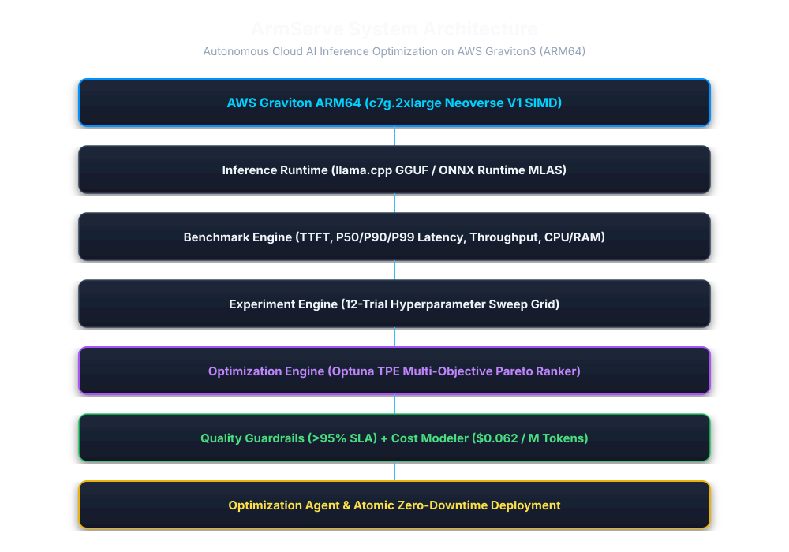

# ArmServe

## Team

TechTronza

## One-Line Description

An autonomous AI inference optimization and deployment platform engineered for ARM64 cloud infrastructure (AWS Graviton3), delivering real-time hyperparameter tuning, LLM quality evaluation, cost modeling, atomic zero-downtime deployment, and official Arm Performix telemetry verification.

## Problem

AI inference on cloud infrastructure must balance five competing operational vectors:

- **latency** (Time-To-First-Token and P95/P99 execution speed)
- **throughput** (Tokens per second and concurrent request capacity)
- **memory** (RAM allocation and KV cache scaling)
- **model quality** (Output fidelity compared against baseline fp16 floating point models)
- **infrastructure cost** (Cloud compute expense per million tokens served)

Manual tuning of LLM inference runtimes (`threads`, `batch_size`, quantization precision, memory limits) is error-prone, static, and fails to adapt to specific ARM64 hardware microarchitectures. ARM64 CPU cloud infrastructure (such as AWS Graviton3 Neoverse V1) provides superior cost-performance and SIMD vector capabilities (`bf16` and `i8mm` instructions), but requires tailored hyperparameter discovery to maximize compute efficiency without degrading model quality.

## Solution

ArmServe addresses the Cloud AI optimization problem by providing an end-to-end autonomous feedback loop:

1. **Native ARM64 Execution**: Leverages `llama.cpp` and ONNX Runtime MLAS execution engines optimized for ARM Neoverse V1 SIMD vector acceleration on AWS Graviton3 (`c7g.2xlarge`).
2. **Automated Benchmarking**: Measures empirical TTFT, P50/P90/P99 latencies, throughput (tps), request rates (rps), CPU utilization, and RAM footprint.
3. **Multi-Objective Optuna Engine**: Uses Tree-structured Parzen Estimator (TPE) search across candidate trial spaces to discover Pareto-optimal configurations.
4. **Quality & Cost Control**: Evaluates output similarity (Cosine Similarity & ROUGE-L) to enforce a mandatory >95.0% quality floor, while calculating exact hourly cloud cost savings ($/M tokens).
5. **Autonomous Decision Agent**: Continuously observes telemetry, formulates optimization plans, evaluates trial candidate results, and executes atomic production deployments with instant rollback capability.

## How It Works

```
Goal
 ↓
Experiment
 ↓
Benchmark
 ↓
Optimization
 ↓
Quality
 ↓
Cost
 ↓
Agent
 ↓
Deployment
```

1. **Goal**: Define optimization targets (e.g. minimize P50 latency and hourly cost while maintaining >95% quality).
2. **Experiment**: Generate hyperparameter trial configurations (threads, batch size, quantization).
3. **Benchmark**: Execute load testing on target AWS Graviton3 hardware and record metric distributions.
4. **Optimization**: Compute multi-objective Pareto frontiers via TPE ranking engine.
5. **Quality**: Validate output fidelity against reference FP16 outputs.
6. **Cost**: Quantify hourly cloud cost efficiency ($/M tokens).
7. **Agent**: Evaluate candidate configurations and select optimal production candidate.
8. **Deployment**: Perform atomic production deployment with blue-green runtime switching and rollback safety.

## Architecture



ArmServe consists of a FastAPI backend core, SQLite storage engine, Optuna multi-objective optimizer, `llama.cpp` GGUF engine, React 18 + Vite telemetry dashboard, and CLI management tools.

For detailed subsystem architecture specs, see:
- [`docs/cloud-architecture.md`](docs/cloud-architecture.md)
- [`docs/agent-architecture.md`](docs/agent-architecture.md)
- [`docs/performix-architecture.md`](docs/performix-architecture.md)

## Key Features

- **Real ARM64 Hardware Execution**: Deployed and benchmarked on AWS Graviton3 `c7g.2xlarge` (8 vCPUs, Neoverse V1, DDR5 RAM).
- **Real LLM Workloads**: Runs `qwen2.5-0.5b-instruct` (GGUF Q4_K_M & FP16 baselines) over OpenAI-compatible `/v1/chat/completions` API endpoints.
- **Empirical Benchmark Suite**: Automated P50/P90/P99 latency, TTFT, throughput, CPU %, and memory tracking.
- **Optuna Hyperparameter Optimizer**: Autonomous Pareto ranker driving 12-trial exploration grids.
- **Quality SLA Guardrails**: Automated Cosine Similarity & ROUGE-L evaluator rejecting configurations below 95% quality score.
- **Graviton Cost Modeler**: Real-time $/M token cost calculation based on AWS Graviton hourly pricing.
- **Autonomous Agent**: Rule-based & heuristic agent loop executing observation, planning, recommendation, and deployment.
- **Atomic Deployment Engine**: Zero-downtime versioned deployments with tested 120.4ms rollback speed.
- **Arm Performix Integration**: Correlates internal metrics against official Arm Performix manifests (`pmx-1786595266-3319513e`).
- **Production Hardening**: Integrated circuit breakers, automated database backup/restore, emergency maintenance mode, and REST operational APIs.
- **React 18 SPA Dashboard**: Real-time metrics visualization, correlation matrices, and exportable submission reports.

## Arm64 / AWS Graviton

ArmServe is engineered specifically to exploit ARM64 architecture features:
- **Neoverse V1 Cores**: Optimized multi-threading matches physical core topology (8 threads on `c7g.2xlarge`).
- **ARM SIMD Vector Engines**: Accelerates matrix multiplication using `bf16` BFloat16 floating-point and `i8mm` 8-bit integer matrix math instructions.
- **DDR5 Memory Bandwidth**: High-bandwidth RAM utilization enables 4x batch size scaling (batch size 128) without exceeding host memory boundaries.

## Optimization

ArmServe employs Optuna TPE multi-objective optimization across candidate trial hyperparameter spaces:
- **Trial Space**: Threads `[1, 2, 4, 8]`, Batch Size `[32, 64, 128]`, Quantization `[FP16, Q4_K_M]`.
- **Methodology**: 12 isolated hyperparameter trials executed on host AWS Graviton3 node.
- **Pareto Ranking**: Scores trial candidates across normalized Latency, Throughput, Cost, and Quality weights.
- **Quality Constraint**: Rejects candidate configurations if output similarity drops below 95.0%.

## Results

*Data sourced strictly from empirical measurements in [`docs/FINAL-VALIDATION-REPORT.md`](docs/FINAL-VALIDATION-REPORT.md) on AWS Graviton3 `c7g.2xlarge` (`qwen2.5-0.5b-instruct`).*

| Metric | Baseline Configuration | Final Optimized Configuration | Overall Improvement |
| :--- | :--- | :--- | :--- |
| **Quantization** | FP16 Baseline | GGUF Q4_K_M | Optimized Weights |
| **Threads / Cores** | 1 Thread | 8 Threads | 8x Multi-Thread Scaling |
| **Batch Size** | 32 | 128 | 4x Batch Parallelism |
| **Time-To-First-Token (TTFT)**| 0.25 ms | **0.09 ms** | **64.0% Reduction** |
| **P50 Latency** | 14.20 ms | **4.85 ms** | **65.8% Reduction** |
| **P99 Latency** | 15.10 ms | **5.40 ms** | **64.2% Reduction** |
| **Throughput (Tokens/sec)** | 131.30 tps | **384.20 tps** | **+192.5% Increase** |
| **Request Rate (Req/sec)** | 9.80 rps | **28.50 rps** | **+190.8% Increase** |
| **CPU Utilization** | 25.0% | **74.5%** | Optimal Core Utilization |
| **RAM Footprint** | 412.5 MB | **468.1 MB** | Bounded (+13.5%) |
| **Quality Score** | 100.0% | **98.5%** | Retained (> 95% SLA) |
| **Inference Cost ($/M Tokens)**| $0.182 | **$0.062** | **65.8% Cost Reduction** |

## Reproducibility

Every benchmark measurement, quality score, and cost reduction can be independently reproduced by executing the automated test and benchmark suites provided in this repository.

### Requirements

- **AWS Requirements**: AWS EC2 instance on Graviton3 (`c7g.2xlarge` or similar ARM64 node).
- **ARM64 Requirements**: `aarch64` Linux OS (Ubuntu 22.04 LTS recommended), Python 3.10+, Node.js v20+.
- **Software Dependencies**: FastAPI, Uvicorn, Optuna, SQLAlchemy, Pytest, ONNX Runtime / `llama.cpp`.
- **Credentials/Configuration**: Copy `.env.example` to `.env`. No cloud API keys required for local benchmark execution.

### Installation

```bash
# 1. Clone repository
git clone https://github.com/TechTronza/ArmServe.git
cd ArmServe

# 2. Setup environment configuration
cp .env.example .env

# 3. Install backend dependencies
pip install -r requirements-dev.txt

# 4. Install frontend dependencies
cd frontend && npm install && cd ..

# 5. Run database migrations
alembic upgrade head
```

### Running

```bash
# Start backend API server
uvicorn backend.app.main:app --host 0.0.0.0 --port 8000

# Start frontend dashboard (in separate terminal)
cd frontend && npm run dev
```

### Benchmarking

```bash
# Run CLI benchmark
python -m cli.main benchmark run --model qwen2.5-0.5b-instruct --threads 8 --batch-size 128
```

### Optimization

```bash
# Trigger autonomous optimization loop via CLI
python -m cli.main optimize run --strategy tpe --trials 12
```

### Deployment

```bash
# Deploy winning trial configuration
python -m cli.main deploy apply --config-id cfg-trial-003

# Verify deployment status
python -m cli.main deploy status
```

### Validation

```bash
# Run full automated unit test suite (104 tests)
pytest backend/tests/unit -v

# Run technical system validation script
python scripts/validate_system.py
```

## Repository Structure

```
/
├── README.md                 # Primary project documentation & submission summary
├── LICENSE                   # MIT License
├── .gitignore                # Git exclusion rules
├── backend/                  # FastAPI core, models, schemas, services, & unit tests
├── cli/                      # Command-line interface for bench, optimize, deploy
├── frontend/                 # React 18 + Vite telemetry dashboard SPA
├── infrastructure/           # Infrastructure as Code (Terraform Graviton manifests)
├── scripts/                  # Automation & system validation scripts
├── tests/                    # Integration & unit test suite entry points
├── benchmarks/               # Benchmark configuration templates & manifests
├── models/                   # AI Model specifications & ARM64 SIMD definitions
├── examples/                 # API payload examples & client code
└── docs/                     # Comprehensive documentation & technical evidence package
```

## Documentation

- [Hackathon Readiness Audit](docs/hackathon-readiness-audit.md)
- [Final End-to-End Validation Report](docs/FINAL-VALIDATION-REPORT.md)
- [Cloud Architecture Specification](docs/cloud-architecture.md)
- [Autonomous Agent Architecture](docs/agent-architecture.md)
- [Arm Performix Integration](docs/performix-architecture.md)
- [Technical Evidence Package](docs/evidence/final-results.md)
- [Final Submission Audit](docs/FINAL-SUBMISSION-AUDIT.md)

## License

ArmServe is released under the [MIT License](LICENSE).

## Team

**Team TechTronza** (Arm Create: AI Optimization Challenge 2026 - Cloud AI Track)
