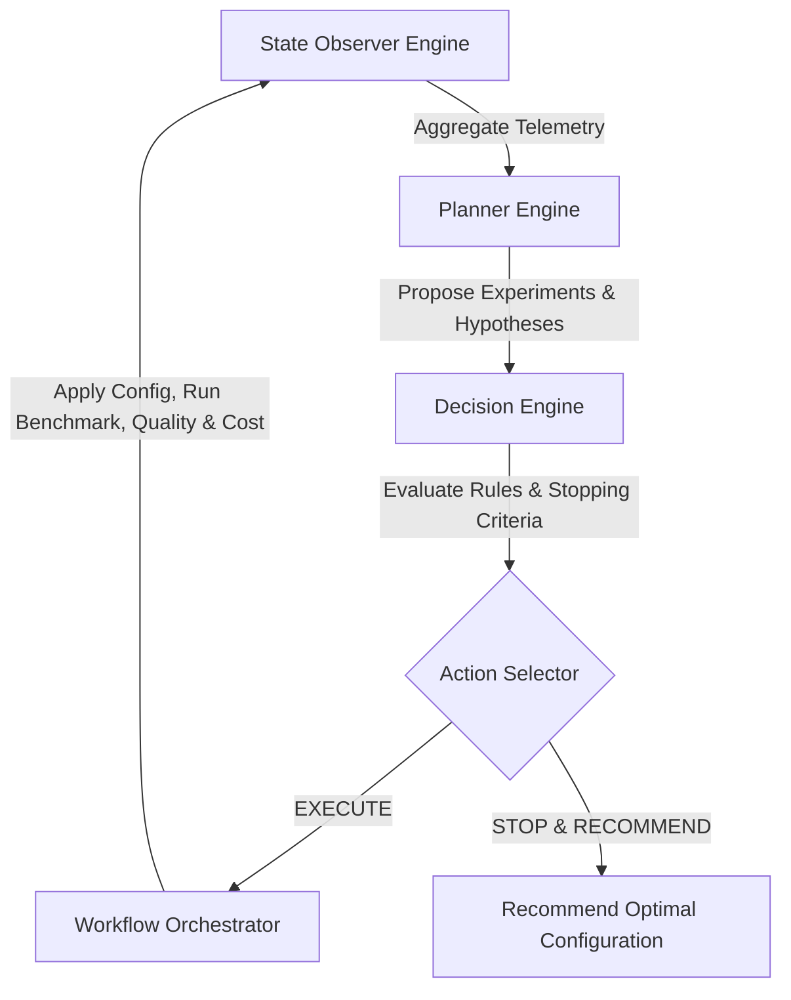

# ArmServe Autonomous Optimization Agent Architecture

**Role**: AI Systems Architect  
**Platform**: ArmServe Autonomous AI Optimization Engine (AWS Graviton ARM64)  
**Objective**: Architectural specification for an autonomous agent loop that observes, plans, executes, evaluates, and decides optimal runtime CPU inference configurations using empirical measurement evidence.

---

## 1. Agent Architecture & Loop Overview

The agent operates in a closed-loop control cycle governed by strict empirical guardrails:
1. **Observation**: Collects hardware metrics, benchmark runs, SLA scores, quality evaluations, and cost calculations.
2. **Planning**: Identifies unexplored parameters, generates hypotheses, avoids past failure modes, and creates experiment proposals.
3. **Decision**: Evaluates convergence trends against stopping criteria (max trials, SLA targets achieved, sub-1% improvement threshold) and logs evidence-based rationale.
4. **Orchestration**: Executes runtime parameters, benchmarks performance, scores quality, computes cost savings, and persists cycle state.

---

## 2. Agent Decision & Stopping Criteria Framework

### Stopping Criteria Rules
1. **Convergence Limit**: If composite utility score improves by $< 0.5\%$ over 3 consecutive trials, halt optimization.
2. **Target Met**: If latency $P50 \le \text{Target}$ and throughput $\ge \text{Target}$ and quality score $Q \ge 80.0$, halt and recommend.
3. **Trial Safety Cap**: Max 10 autonomous trials per optimization run.
4. **Quality Guardrail Breach**: If quality drops $> 2.0\%$, reject proposal and revert.

### Action Types
- `EXECUTE_PLAN`: Schedule and execute the next planned experiment.
- `RETRY_TRANSIENT`: Retry failed trial with exponential backoff.
- `STOP_CONVERGED`: Cease optimization due to score plateau.
- `STOP_TARGET_REACHED`: Cease optimization because SLA latency/throughput target was met.
- `STOP_MAX_EXPERIMENTS`: Cease optimization because trial limit was reached.
