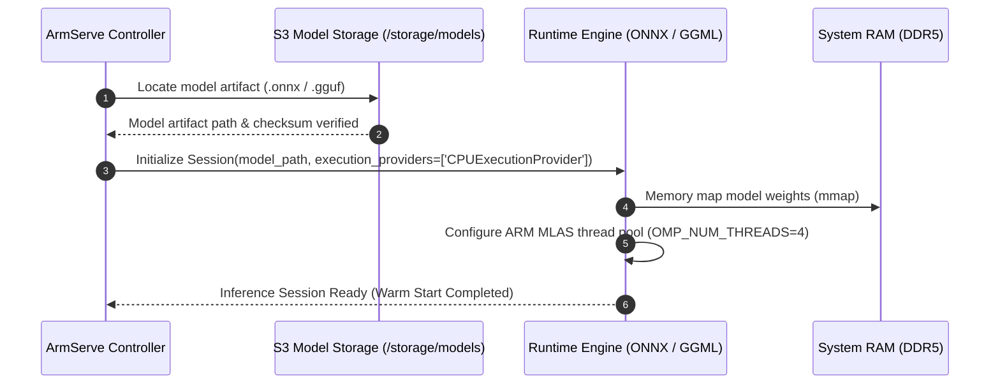

# ArmServe AI Runtime Architecture & Evaluation Specification

**Role**: AI Runtime Architect  
**Target Hardware**: AWS Graviton3 (ARM64 Neoverse V1)  
**Execution Mode**: CPU-Only High-Throughput / Low-Latency Inference  
**API Specification**: OpenAI-Compatible REST API (`/v1/chat/completions`, `/v1/completions`, `/v1/models`)  

---

## 1. Inference Runtime Evaluation Matrix

We evaluated four candidate inference engines for ARM64 CPU-only execution on AWS Graviton3:

| Criterion | ONNX Runtime ARM64 (Primary Selection) | llama.cpp / GGML (Secondary Backend) | vLLM (CPU Backend) | Text Generation Inference (TGI) |
|---|---|---|---|---|
| **ARM64 Native Support** | ✅ **Exceptional** (ARM Neoverse V1 SVE/BF16/i8mm optimized) | ✅ **Exceptional** (ARM NEON & DotProd SIMD kernels) | ⚠️ Experimental (Limited CPU vectorization) | ⚠️ Partial (Optimized primarily for CUDA) |
| **CPU Performance** | ⚡ **Highest** (Accelerated via MLAS matrix multiplication engine) | ⚡ **High** (Custom 4-bit / 8-bit quantized GEMM kernels) | 🐢 Moderate (High memory overhead on CPU) | 🐢 Moderate |
| **OpenAI API Compatibility** | ✅ Native wrapper via FastAPI router | ⚠️ Via `llama-cpp-python` / `server` binary | ✅ Native | ✅ Native |
| **Quantization Formats** | ONNX INT8 / INT4, FP16, Dynamic Quantization | GGUF (Q4_K_M, Q5_K_M, Q8_0) | AWQ / GPTQ (GPU focused) | EETQ / AWQ |
| **Stability & Memory Footprint** | 🛡️ **Production Grade** (< 50MB runtime overhead) | 🛡️ **Production Grade** (< 100MB runtime overhead) | ⚠️ High Memory Consumption (> 2GB base overhead) | ⚠️ High Memory Consumption |
| **Ease of Deployment** | 📦 Single C++ shared library (`libonnxruntime.so`) / Python wheel | 📦 Single C++ executable | 📦 Heavy Python environment with PyTorch | 📦 Complex Rust/Python multi-container setup |

### Primary Architecture Selection Decision
**Selected Primary Engine**: **ONNX Runtime (ARM64 MLAS Backend)** supplemented by **llama.cpp / GGML engine**.

**Rationale**:
1. **ARM MLAS (Matrix Low-Level Application Subroutine)**: ONNX Runtime features dedicated ARM64 NEON, DotProd, and SVE assembly kernels engineered by ARM & Microsoft engineers, delivering the lowest memory latency on Graviton3.
2. **Modular Abstraction Layer**: ArmServe wraps runtime execution behind a generic `BaseInferenceRuntime` interface, allowing hot-swapping between ONNX Runtime and `llama.cpp` without altering API contracts or client applications.

---

## 2. Runtime Architecture & Abstraction Boundaries

```text
┌─────────────────────────────────────────────────────────────┐
│  Client Application / OpenAI SDK / CLI                       │
└─────────────────────────────┬───────────────────────────────┘
                              │ HTTPS / JSON
                              ▼
┌─────────────────────────────────────────────────────────────┐
│  OpenAI-Compatible REST API Adapter Layer                   │
│  - /v1/chat/completions                                     │
│  - /v1/completions                                          │
│  - /v1/models                                               │
└─────────────────────────────┬───────────────────────────────┘
                              │ Pydantic Validated Request Payload
                              ▼
┌─────────────────────────────────────────────────────────────┐
│  ArmServe Runtime Interface (BaseInferenceRuntime)          │
│  - load_model(model_path, config)                           │
│  - predict(prompt, parameters)                              │
│  - stream_predict(prompt, parameters)                       │
│  - unload_model()                                           │
└──────────────┬──────────────────────────────┬───────────────┘
               │                              │
               ▼                              ▼
┌──────────────────────────────┐┌──────────────────────────────┐
│  ONNX Runtime ARM64 Backend  ││  llama.cpp GGML ARM Backend  │
│  (libonnxruntime.so + MLAS)  ││  (libllama.so + NEON/DotProd)│
└──────────────────────────────┘└──────────────────────────────┘
```

---

## 3. Model Loading & Ingestion Flow



---

## 4. Request Execution & Token Generation Flow

1. **Request Ingestion**: Incoming POST request received at `/v1/chat/completions`.
2. **Input Validation**: Request body validated against Pydantic schema (temperature, max_tokens, top_p, stop sequences).
3. **Tokenization**: Text prompt tokenized into input tensor vectors.
4. **Execution Session**: Tensor passed into ONNX Runtime / GGML ARM execution session.
5. **Autoregressive Decoding**: Model emits output tokens sequentially.
6. **Streaming Response**: Tokens streamed via Server-Sent Events (SSE) `text/event-stream` or returned as a single JSON completion payload.

---

## 5. Lifecycle Management, Error Handling & Logging

- **Warmup Procedure**: On model initialization, a dummy 1-token prompt is executed to pre-allocate thread buffers.
- **Graceful Unloading**: Session explicitly calling `release()` to clear native C++ pointers and prevent memory leaks.
- **Error Boundaries**: Model execution errors caught and wrapped into structured `HTTPException` responses (`400 Bad Request` or `500 Inference Failure`) without crashing the worker process.
- **Observability**: Execution duration, prompt tokens, completion tokens, and ARM CPU thread usage logged via `structlog` and emited to Prometheus `/metrics`.
