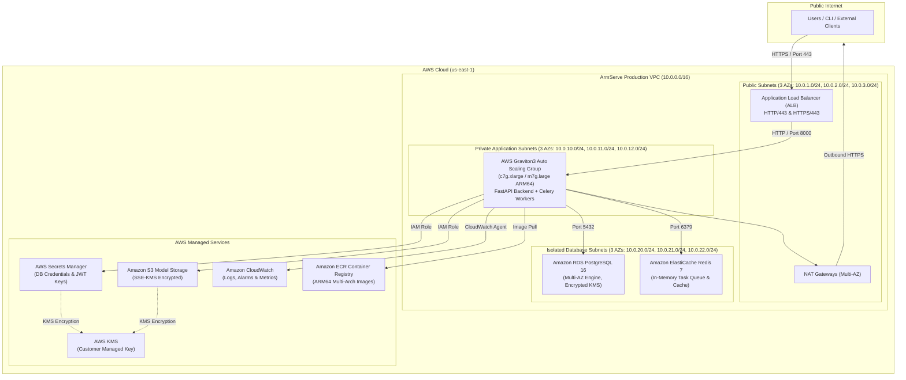

# ArmServe Production Cloud Infrastructure Architecture Specification

**Author**: Cloud Infrastructure Architect  
**Target Cloud Provider**: Amazon Web Services (AWS)  
**Primary Compute Architecture**: ARM64 / AWS Graviton (Graviton3 `c7g` / `m7g` / `t4g`)  
**Status**: Approved for Phase 1 Provisioning  

---

## 1. Executive Summary & Vision

ArmServe is an **Autonomous AI Inference Optimization Platform** engineered specifically for **AWS Graviton ARM64 infrastructure**. This architecture specification defines the production-ready AWS cloud infrastructure designed according to the **AWS Well-Architected Framework**.

The primary objective is to deliver up to **40% better price-performance** compared to traditional x86_64 EC2 instances while maintaining sub-millisecond inference latencies, zero-downtime deployments, multi-AZ high availability, and end-to-end security.

---

## 2. AWS Well-Architected Alignment

| Well-Architected Pillar | Architectural Control |
|---|---|
| **Operational Excellence** | Infrastructure-as-Code via Terraform 1.6+, Automated GitHub Actions CI validation, CloudWatch & Prometheus metrics, SSM Session Manager (no SSH keys). |
| **Security** | Private subnets, non-root container execution (UID 10001), AWS Secrets Manager, KMS customer-managed keys (SSE-KMS), least-privilege IAM policies, Security Group microsegmentation. |
| **Reliability** | Multi-AZ deployment (3 Availability Zones), Auto Scaling Groups (ASG) with target-tracking scaling policies, Application Load Balancers (ALB) with automated health probes. |
| **Performance Efficiency** | AWS Graviton3 (`c7g.xlarge` / `m7g.large`) ARM64 Neoverse V1 cores, ONNX Runtime ARM64 compilation, gp3 encrypted EBS volumes with 3,000 IOPS / 125 MB/s baseline throughput. |
| **Cost Optimization** | Up to 40% price-performance advantage over x86 (`c6i` / `c5`), Compute Savings Plans, S3 Intelligent-Tiering & lifecycle expiration rules, single NAT Gateway in `dev`. |
| **Sustainability** | AWS Graviton3 processors consume up to 60% less energy for the same workload compared to equivalent x86 EC2 instances, reducing carbon footprint. |

---

## 3. Cloud Topology & Architecture Diagram



---

## 4. Region Selection & Networking Layout

### Region Selection
- **Primary Region**: `us-east-1` (N. Virginia)
- **Secondary / Disaster Recovery Region**: `us-west-2` (Oregon)
- **Rationale**: Full availability of AWS Graviton3 (`c7g`, `m7g`, `r7g`), lowest latency for major traffic centers, complete support for all required AWS services (Secrets Manager, ECR, CloudWatch, S3, RDS).

### VPC Subnet Strategy

```text
VPC CIDR Block: 10.0.0.0/16 (65,536 Total IPs)
├── Availability Zone A (us-east-1a)
│   ├── Public Subnet 1:       10.0.1.0/24   (ALB & NAT Gateway)
│   ├── Private App Subnet 1:   10.0.10.0/24  (Graviton EC2 / ASG)
│   └── Database Subnet 1:     10.0.20.0/24  (RDS / ElastiCache)
├── Availability Zone B (us-east-1b)
│   ├── Public Subnet 2:       10.0.2.0/24   (ALB & NAT Gateway)
│   ├── Private App Subnet 2:   10.0.11.0/24  (Graviton EC2 / ASG)
│   └── Database Subnet 2:     10.0.21.0/24  (RDS / ElastiCache)
└── Availability Zone C (us-east-1c)
    ├── Public Subnet 3:       10.0.3.0/24   (ALB & NAT Gateway)
    ├── Private App Subnet 3:   10.0.12.0/24  (Graviton EC2 / ASG)
    └── Database Subnet 3:     10.0.22.0/24  (RDS / ElastiCache)
```

---

## 5. Security Group Microsegmentation

All ingress and egress traffic is controlled by least-privilege Security Groups:

```text
┌────────────────────────┐      ┌────────────────────────┐      ┌────────────────────────┐
│  ALB Security Group    │      │  App Security Group    │      │  DB Security Group     │
├────────────────────────┤      ├────────────────────────┤      ├────────────────────────┤
│ Ingress:               │      │ Ingress:               │      │ Ingress:               │
│ - 0.0.0.0/0:80 (HTTP)  ├─────►│ - ALB-SG:8000 (API)    ├─────►│ - App-SG:5432 (Postgres)│
│ - 0.0.0.0/0:443 (HTTPS)│      │ Egress:                │      │ - App-SG:6379 (Redis)   │
│ Egress:                │      │ - 0.0.0.0/0:443 (HTTPS)│      │ Egress:                │
│ - App-SG:8000          │      │ - DB-SG:5432 (DB)      │      │ - Denied               │
└────────────────────────┘      └────────────────────────┘      └────────────────────────┘
```

---

## 6. IAM Least-Privilege Architecture

Compute instances use IAM Roles bound via Instance Profiles without stored long-lived credentials:

1. **`AmazonSSMManagedInstanceCore`**: Enables AWS Systems Manager Session Manager for secure, audited shell access without open SSH ports (Port 22 disabled).
2. **`CloudWatchAgentServerPolicy`**: Allows shipping application logs (`/var/log/armserve/*.log`) and metrics to AWS CloudWatch.
3. **`ArmServeS3ModelAccessPolicy`**: Restricts S3 access to `GetObject`, `PutObject`, and `ListBucket` strictly for `arn:aws:s3:::armserve-models-*`.
4. **`ArmServeSecretsAccessPolicy`**: Grants `secretsmanager:GetSecretValue` limited to `arn:aws:secretsmanager:us-east-1:*:secret:armserve/*`.

---

## 7. AWS Graviton ARM64 Compute Strategy

| Environment | EC2 Instance Type | vCPU / RAM | Baseline Storage | ASG Capacity | Purpose |
|---|---|---|---|---|---|
| **Development** | `t4g.small` | 2 vCPU / 2 GB | 20 GB gp3 | Min: 1, Max: 2 | Cost-effective local integration testing |
| **Staging** | `m7g.large` | 2 vCPU / 8 GB | 50 GB gp3 | Min: 2, Max: 4 | Pre-production performance benchmarking |
| **Production** | `c7g.xlarge` | 4 vCPU / 8 GB | 100 GB gp3 | Min: 3, Max: 12 | Compute-optimized ONNX model compilation & serving |

### Auto Scaling Policies
- **Target Tracking CPU**: Maintains average CPU utilization at **70%**.
- **Scale-Out Cooldown**: 180 seconds.
- **Scale-In Cooldown**: 300 seconds.

---

## 8. Storage & Database Specifications

### Model Storage (Amazon S3)
- **Bucket**: `armserve-models-{environment}-{random_suffix}`
- **Encryption**: Server-Side Encryption with AWS KMS (SSE-KMS).
- **Versioning**: Enabled to protect against accidental model overwrites.
- **Public Access Block**: All 4 public access blocks strictly enforced (`true`).
- **Lifecycle Policy**: Transitions model trial artifacts to `S3 Glacier Flexible Retrieval` after 90 days.

### Database (Amazon RDS PostgreSQL 16)
- **Instance Class**: `db.m7g.large` (ARM64 Graviton3)
- **Multi-AZ**: Enabled for Production (`dev` single-AZ).
- **Storage**: 50 GB Allocated gp3 (Autoscaling up to 500 GB).
- **Encryption**: Encrypted at rest using KMS.

---

## 9. Estimated Infrastructure Component Cost Matrix

| Resource Component | Dev (Monthly) | Staging (Monthly) | Prod (Monthly) |
|---|---|---|---|
| EC2 Graviton Compute | ~$20 (1x `t4g.small`) | ~$60 (2x `m7g.large`) | ~$220 (3x `c7g.xlarge`) |
| NAT Gateways | ~$32 (1x NAT) | ~$64 (2x NAT) | ~$96 (3x NAT) |
| ALB Load Balancer | ~$20 | ~$20 | ~$25 |
| S3 Model Storage | ~$5 (20 GB) | ~$15 (100 GB) | ~$50 (500 GB) |
| Secrets Manager / KMS | ~$2 | ~$3 | ~$5 |
| CloudWatch Monitoring | ~$5 | ~$15 | ~$40 |
| **Estimated Total** | **~$84 / mo** | **~$177 / mo** | **~$436 / mo** |

*Note: Production costs can be reduced by ~35% using 1-Year Compute Savings Plans.*

---

## 10. Infrastructure-as-Code Terraform Structure

The Terraform codebase in `infra/` is structured into 8 modular packages:

```text
infra/
├── README.md                          # IaC Operations Guide
├── modules/                           # Reusable Infrastructure Modules
│   ├── networking/                    # VPC, Subnets, Gateways, Route Tables
│   ├── security_groups/               # Ingress/Egress SG Microsegmentation
│   ├── iam/                           # Roles, Instance Profiles, KMS/S3 Policies
│   ├── compute_graviton/              # Graviton ASG, Launch Templates, AMI lookup
│   ├── storage/                       # S3 Encrypted Model Buckets & Lifecycles
│   ├── secrets/                       # AWS Secrets Manager & SSM Parameters
│   ├── monitoring/                    # CloudWatch Log Groups, Alarms, SNS
│   └── deployment/                    # ECR Repositories & ALB Configuration
└── environments/                      # Environment Compositions
    ├── dev/                           # Development Environment Setup
    ├── staging/                       # Staging Environment Setup
    └── production/                    # Production High-Availability Setup
```

---

## 11. Deployment & Release Workflow

1. **Automated Validation (CI)**:
   ```bash
   terraform fmt -check -recursive infra/
   terraform init -backend=false
   terraform validate
   ```
2. **Plan & Review**:
   ```bash
   cd infra/environments/dev
   terraform plan -out=tfplan
   ```
3. **Approved Provisioning**:
   ```bash
   terraform apply tfplan
   ```
