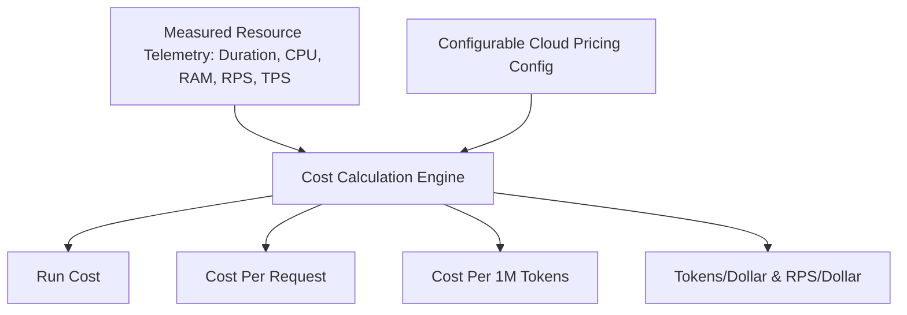

# ArmServe Cloud Cost Analysis Framework Specification

**Role**: Cloud Cost Architect  
**Platform**: ArmServe AI Optimization & Inference Platform (AWS Graviton ARM64)  
**Objective**: Mathematical framework for calculating, modeling, and comparing cloud infrastructure costs based on measured inference telemetry.

---

## 1. AWS Graviton Pricing Reference Models

ArmServe utilizes real cloud provider instance rates (configurable via API and environment settings):

| Provider | Instance Family | vCPU | RAM (GiB) | On-Demand Rate ($/hr) | Spot Rate ($/hr) | Architecture |
|---|---|---|---|---|---|---|
| **AWS** | `c7g.xlarge` | 4 | 8 | $0.1450 | $0.0580 | Graviton3 (Neoverse V1) |
| **AWS** | `c7g.2xlarge` | 8 | 16 | $0.2900 | $0.1160 | Graviton3 (Neoverse V1) |
| **AWS** | `r7g.xlarge` | 4 | 32 | $0.2144 | $0.0858 | Graviton3 (Memory-Optimized) |
| **AWS** | `c8g.xlarge` | 4 | 8 | $0.1595 | $0.0638 | Graviton4 (Neoverse V2) |

---

## 2. Quantitative Cost Calculation Formulas

### 1. Hourly & Per-Second Instance Rate
$$\text{Cost}_{\text{sec}} = \frac{\text{Hourly Rate}}{3600}$$

### 2. Benchmark Run Execution Cost
$$\text{Cost}_{\text{run}} = \text{Cost}_{\text{sec}} \times \text{Execution Duration (sec)}$$

### 3. Cost Per Inference Request
$$\text{Cost}_{\text{req}} = \frac{\text{Cost}_{\text{run}}}{\text{Total Requests Processed}}$$

### 4. Cost Per 1 Million Generated Tokens
$$\text{Cost}_{1\text{M tokens}} = \left( \frac{\text{Cost}_{\text{run}}}{\text{Total Tokens Generated}} \right) \times 1,000,000$$

### 5. Cost Efficiency Metrics
- **Throughput Per Dollar**: $\text{TPD} = \frac{\text{Requests / sec}}{\text{Hourly Rate (\$)}}$
- **Tokens Per Dollar**: $\text{TKPD} = \frac{\text{Tokens / sec}}{\text{Hourly Rate (\$)}}$
- **Latency Efficiency**: $\text{LPD} = \frac{1}{\text{P50 Latency (ms)} \times \text{Hourly Rate (\$)}}$

---

## 3. Cost Dimensions & Metrics

1. **Compute & RAM Overhead**: Direct allocation cost derived from instance type and duration.
2. **Concurrency Efficiency**: Scaling efficiency under multi-tenant queue depth.
3. **Throughput Efficiency**: Revenue cost per million generated completion tokens.
