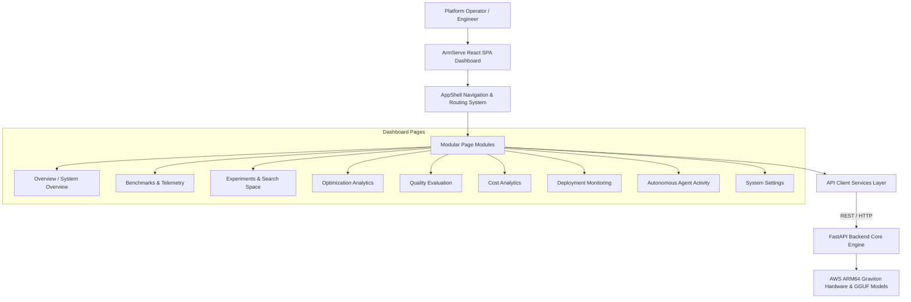
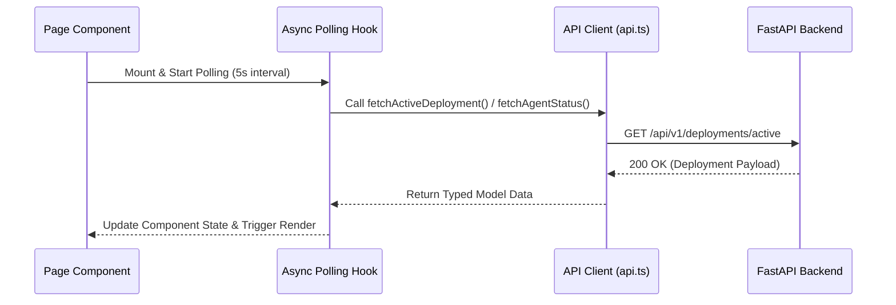

# Dashboard Architecture: ArmServe Platform

**Document Version**: 1.0.0  
**Platform**: ArmServe AI Optimization Platform for AWS ARM64 Infrastructure (AWS Graviton3 / Neoverse V1)  
**Status**: APPROVED  

---

## 1. Executive Overview

The ArmServe Dashboard is a modern, responsive, real-time web application providing total observability and autonomous management for AI model inference on AWS ARM64 Graviton infrastructure. Built with React, TypeScript, Vite, and Lucide design icons, the frontend connects directly to ArmServe backend REST APIs without synthetic mocks or static hardcoded values.

---

## 2. Page Architecture & Modular Navigation

The dashboard layout (`AppShell`) uses a responsive sidebar navigation with active indicator badges, breadcrumbs, status indicators, and polling refresh controls.

| Page Identifier | Title | Purpose & Visualizations | Key Backend APIs |
| :--- | :--- | :--- | :--- |
| `overview` | **Home / Overview** | System overview status, active model, health, agent state, quick metrics summary cards. | `/health`, `/ready`, `/api/v1/system/info`, `/api/v1/deployments/active`, `/api/v1/agent/status` |
| `benchmarks` | **Benchmarks** | Interactive benchmark telemetry (Latency trends, TTFT, Tokens/sec, CPU %, RAM MB), filtering, pagination. | `/api/v1/benchmarks/runs`, `/api/v1/benchmarks/compare` |
| `experiments` | **Experiments** | Search space configuration, trial execution timeline, budget tracking, trial comparison. | `/api/v1/experiments`, `/api/v1/experiments/{id}` |
| `optimization` | **Optimization** | Top ranked configurations, Pareto frontier score breakdowns, rejected configs, decision rationale. | `/api/v1/optimization/rankings`, `/api/v1/optimization/recommendations` |
| `quality` | **Quality** | Semantic quality dataset scoring (BLEU, ROUGE, similarity), response collection analysis. | `/api/v1/quality/datasets`, `/api/v1/quality/evaluations` |
| `cost` | **Cost Analytics** | AWS Graviton3 vs x86 cost savings, $/1M tokens projection, instance cost-performance trade-offs. | `/api/v1/optimization/cost/calculate` |
| `deployments` | **Deployments** | Deployment version history, 5-stage health status, active deployment, zero-downtime rollback controls. | `/api/v1/deployments`, `/api/v1/deployments/health`, `POST /deployments/{id}/rollback` |
| `agent` | **Agent Activity** | Autonomous optimization agent workflow state, live decisions, generated experiments, plan & stopping reason. | `/api/v1/agent/status`, `/api/v1/agent/decisions`, `/api/v1/agent/history` |
| `settings` | **Settings** | Pydantic configuration validation, runtime parameters, database connection pool, env vars. | `/api/v1/system/config/validate`, `/api/v1/system/info` |

---

## 3. State Management & Real-Time Polling Strategy

- **Local & Async State**: Managed via standard React hooks (`useState`, `useEffect`, `useCallback`) ensuring component lifecycle safety.
- **Auto-Refresh Polling**: Configurable automatic refresh interval (e.g., 5-second polling for live deployment metrics and active agent workflows) with pause/resume controls.
- **Optimistic UI Updates**: State mutations (e.g., triggering a rollback or starting an agent run) update local UI state immediately while verifying API responses in the background.

---

## 4. API Integration & Error Resilience

All HTTP requests are routed through a single typed API client ([frontend/src/services/api.ts](file:///c:/Users/mm989/Downloads/Study/ArmInferX/frontend/src/services/api.ts)).

### Error Handling Strategy
1. **Typed Error Normalization**: Backend error payloads (`ApiError`) are parsed into structured user alerts.
2. **Fallback UI Boundaries**: Network disconnects or endpoint errors display friendly inline error state cards with "Retry Connection" buttons rather than breaking the application.
3. **Skeleton Loading States**: Skeleton UI cards and pulse shimmer placeholders preserve layout stability during initial data fetch operations.

---

## 5. Chart & Data Visualization Strategy

Charts use lightweight, responsive inline SVG graphics and styled CSS metric bars designed specifically for high-density AI telemetry:

- **Latency Trend Charts**: Responsive SVG line paths rendering P50, P90, and P99 millisecond distributions over time.
- **Throughput & Resource Gauges**: Dynamic radial and horizontal SVG progress bars indicating TPS (Tokens/sec), CPU utilization %, and RAM memory footprint.
- **Optimization Score Distribution**: Comparative SVG bar charts visualizing composite optimization scores across parameter trials.

---

## 6. Verification & Extensibility Guidelines

The frontend is organized into modular directories:
- `src/components/layout`: Core UI shell, sidebar navigation, headers, footers.
- `src/components/common`: Reusable UI primitives (Badge, Card, LoadingSkeleton, MetricCard, AlertBanner).
- `src/pages`: Page controllers for each platform domain.
- `src/services`: Centralized API clients and data transformers.
- `src/config`: Environment variables and API base URL configurations.

Future modules (e.g. multi-node cluster administration) can be added simply by registering a new page component in `AppShell.tsx` and adding API client functions in `api.ts`.
