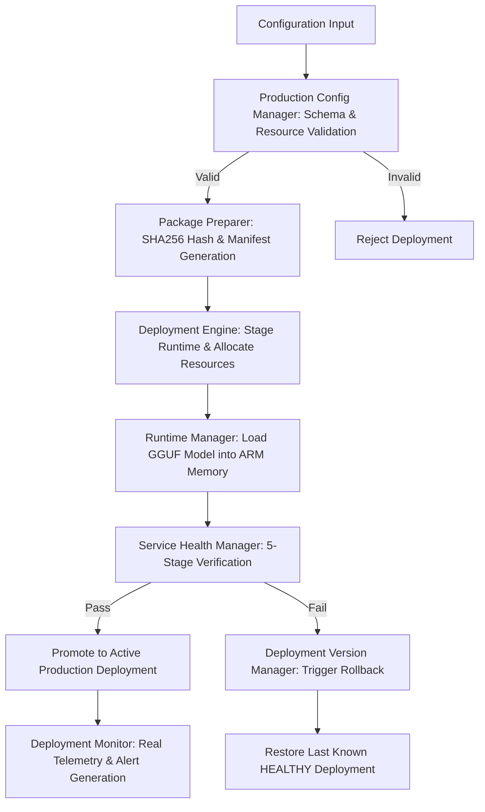
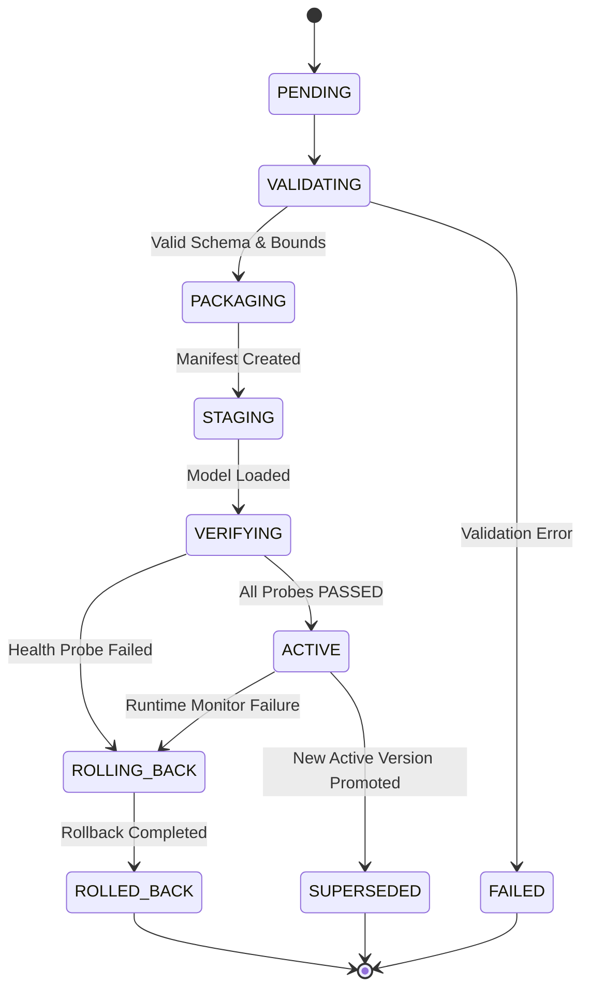
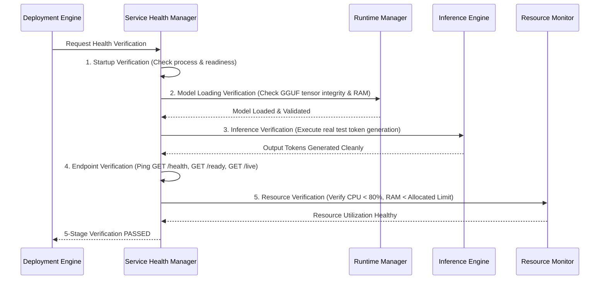

# Production Deployment Architecture: ArmServe Platform

**Document Version**: 1.0.0  
**Platform**: ArmServe AI Optimization Platform for AWS ARM64 Infrastructure (AWS Graviton3 / Neoverse V1)  
**Status**: APPROVED

---

## 1. Executive Overview

ArmServe is an AI inference optimization platform purpose-built for AWS ARM64 Graviton infrastructure. The Deployment Engine automates the production deployment of validated, parameter-optimized model inference configurations. It ensures zero-downtime releases, multi-stage health verification, continuous telemetry monitoring, configuration immutability, and safe, deterministic rollbacks.

---

## 2. Deployment Lifecycle & State Machine

Every production deployment follows a strict deterministic lifecycle. Unvalidated or degraded configurations are strictly prohibited from receiving production inference traffic.

### Lifecycle States

| State | Description | Transition Criteria |
| :--- | :--- | :--- |
| `PENDING` | Deployment request received and queued for processing. | Initial state on submission. |
| `VALIDATING` | Configuration schema, resource limits, model paths, and env vars undergoing verification. | Moves to `PACKAGING` if valid; `FAILED` if validation fails. |
| `PACKAGING` | Immutable deployment manifest generated with SHA-256 version hashes. | Moves to `STAGING` once manifest is persisted. |
| `STAGING` | Runtime parameters applied, memory allocated, and GGUF model loaded. | Moves to `VERIFYING` once server lifecycle reaches `LOADED`. |
| `VERIFYING` | 5-stage health verification executing (startup, model, inference token generation, endpoint, resource bounds). | Moves to `ACTIVE` if all probes pass; `ROLLING_BACK` if any probe fails. |
| `ACTIVE` | Deployment promoted to serve production inference traffic. Active pointer updated. | Moves to `SUPERSEDED` when new release succeeds; `ROLLING_BACK` if monitor detects degradation. |
| `SUPERSEDED` | Previous healthy deployment superseded by a newer active deployment. Retained in history for rollback. | Immutable historical state. |
| `ROLLING_BACK` | Health failure detected. Engine restoring last known `HEALTHY` active deployment. | Moves to `ROLLED_BACK` when previous state is fully restored. |
| `ROLLED_BACK` | Deployment failed health check or was rolled back by operator. Non-active state. | Terminal immutable state. |
| `FAILED` | Deployment validation or unrecoverable setup error occurred. | Terminal immutable state. |

---

## 3. Release Workflow Strategies

ArmServe supports two primary release workflows on AWS ARM64 Graviton instances:

### A. Immutable Blue/Green Release (Default)
1. **Green Environment Allocation**: A secondary isolated runtime worker is initialized with the new configuration (`cfg-vN`).
2. **Model Loading & Warmup**: The GGUF model is loaded into ARM memory and warmed up using baseline prompts.
3. **Verification**: 5-stage health probes test the Green environment independently.
4. **Traffic Promotion**: Upon 100% verification pass, the active deployment pointer switches atomically to the Green runtime.
5. **Drain Blue Environment**: The Blue runtime is set to `SUPERSEDED` and kept available for instant fallback.

### B. Canary Rollout
1. A configurable percentage of inference requests (e.g. 10%) are routed to the candidate deployment.
2. `DeploymentMonitor` aggregates real-time latency p50/p99, error rates, and throughput.
3. If error rate remains `0.0%` and latency remains within SLA thresholds over a 5-minute observation window, traffic is scaled to 100%.

---

## 4. Multi-Stage Health Verification Framework

Before any deployment is promoted to `ACTIVE`, the `ServiceHealthManager` executes 5 mandatory sequential verification probes:

1. **Startup Verification**: Confirms backend process readiness and API route responsiveness.
2. **Model Loading Verification**: Verifies GGUF model tensor structures, quantization variants (e.g. `Q4_K_M`), and memory mapping in ARM64 RAM.
3. **Inference Verification**: Invokes the `InferenceEngine` with a standard benchmark prompt (`What ARM64 Neoverse V1 CPU optimizations are used in ArmServe?`) to ensure token generation completes cleanly without segmentation faults or NaN outputs.
4. **Endpoint Verification**: Pings standard health endpoints (`GET /health`, `GET /ready`, `GET /live`) ensuring `200 OK` status codes.
5. **Resource Verification**: Reads system diagnostics (`psutil`) to confirm CPU utilization is stable and memory footprint does not exceed safety thresholds (`< 80%`).

---

## 5. Automated Rollback & Disaster Recovery Strategy

Safety and high availability are top priorities. If a new deployment fails health verification or experiences runtime degradation while active, ArmServe executes an automated, safe rollback.

### Rollback Execution Algorithm
1. **Trigger Identification**: Automated alert from `DeploymentMonitor` (e.g. `error_rate > 5%`, `latency_p50 > SLA`) or explicit user invocation `POST /deployments/{id}/rollback`.
2. **Active Pointer Identification**: Query `DeploymentRepository` for the most recent `SUPERSEDED` deployment with status `HEALTHY`.
3. **State Transition**: Set current active deployment to `ROLLING_BACK`.
4. **Runtime Switch**: Apply target configuration parameters to `runtime_manager` and reload the target GGUF model into memory.
5. **Verification**: Run fast health check on the restored deployment.
6. **Promotion & Event Audit**: Set restored deployment to `ACTIVE`, set failing deployment to `ROLLED_BACK`, and append an immutable audit log entry in `DeploymentEventRecord` with `event_type="ROLLBACK"`.

> [!IMPORTANT]
> Rollback operations NEVER overwrite historical deployment records. Every release, state change, and rollback is appended immutably to `DeploymentEventRecord` for full regulatory compliance and auditability.

---

## 6. Production Configuration Management

Configurations in ArmServe are 100% configuration-driven and immutable once created:

- **Schema Validation**: Every configuration is validated against strict Pydantic schemas enforcing valid parameter bounds (e.g. `thread_count ∈ [1, 64]`, `batch_size ∈ [1, 512]`, `temperature ∈ [0.0, 2.0]`).
- **SHA-256 Versioning**: Every unique configuration generates a deterministic SHA-256 hash digest (e.g. `cfg-a00a6808e7`) ensuring version traceability.
- **Environment Isolation**: Environment settings (`development`, `staging`, `production`) enforce distinct resource limits and SLA parameters.
- **Configuration Comparison**: Built-in diff utility compares any two configuration manifests and outputs exact parameter changes.

---

## 7. Real-Time Deployment Monitoring & Alerting

The `DeploymentMonitor` continuously gathers real runtime telemetry without synthetic estimation:

### Monitored Metrics
- **Request Count**: Total HTTP & inference requests processed.
- **Latency Distribution**: P50, P90, P99 request latencies in milliseconds.
- **Throughput**: Requests per second (RPS) and Token Generation Throughput (TPS).
- **Resource Utilization**: Real CPU utilization (%) and Memory consumption (MB).
- **Error Rate**: Percentage of HTTP 5xx errors or inference exceptions.
- **Availability**: Percentage uptime calculated as `(Successful Requests / Total Requests) * 100`.

### Alert Conditions

| Alert Code | Severity | Trigger Condition | Action Taken |
| :--- | :--- | :--- | :--- |
| `HIGH_LATENCY` | `WARNING` | P50 latency > 150ms over 1-minute window | Log warning alert and trigger metrics snapshot |
| `HIGH_MEMORY` | `CRITICAL` | Memory consumption > 90% allocated limit | Trigger garbage collection alert & log memory warning |
| `RUNTIME_FAILURE` | `CRITICAL` | Error rate > 5.0% over 10 requests | Set deployment status to `DEGRADED`, alert operator |
| `ENDPOINT_FAILURE` | `CRITICAL` | `/ready` or `/live` probe returns non-200 | Trigger automated rollback to previous `HEALTHY` state |

---

## 8. Summary

The ArmServe Deployment Architecture ensures reproducible, reliable, and observable AI model serving on AWS ARM64 infrastructure. Through multi-stage health verification, automated rollbacks, strict configuration versioning, and real-time monitoring, ArmServe provides enterprise-grade inference optimization.
