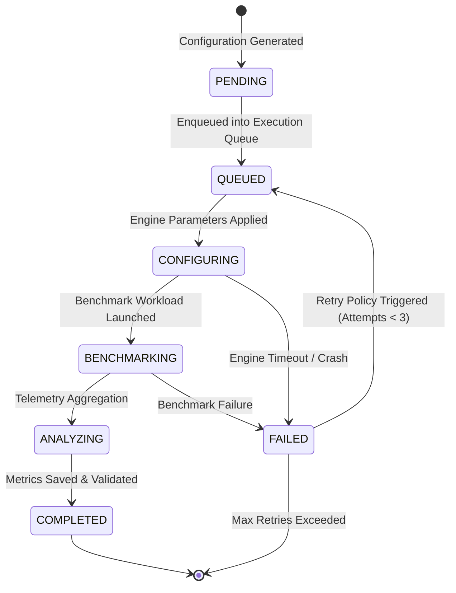

# ArmServe Optimization Experiment Framework Specification

**Role**: Optimization Experiment Architect  
**Target Platform**: ArmServe AI Optimization Engine (AWS Graviton ARM64)  
**Objective**: Autonomous parameter search and real-time execution matrix for tuning LLM inference efficiency on ARM CPUs.

---

## 1. Configurable Runtime Parameters Matrix

Every optimization experiment systematically mutates one or more parameters within validated operational boundaries:

| Parameter Key | Data Type | Default Value | Valid Range / Options | Description |
|---|---|---|---|---|
| **`thread_count`** | `int` | `4` | `1` to `128` (max vCPUs) | CPU execution threads allocated for GEMM matrix multiplication. |
| **`batch_size`** | `int` | `128` | `1` to `2048` (power of 2) | Prompt evaluation token batch processing size. |
| **`context_length`** | `int` | `2048` | `128` to `32768` | Maximum token KV cache allocation window. |
| **`temperature`** | `float` | `0.7` | `0.0` to `2.0` | Sampling temperature for token decoding. |
| **`max_tokens`** | `int` | `256` | `1` to `4096` | Maximum generation completion tokens. |
| **`gpu_layers`** | `int` | `0` | `0` to `64` | Offloaded layers to GPU/NPU (0 for CPU-only ARM64). |
| **`quantization_variant`**| `str` | `"Q4_K_M"` | `"Q4_K_M"`, `"Q8_0"`, `"FP16"` | GGUF weight tensor quantization precision. |
| **`runtime_flags`** | `list[str]` | `["-O3", "-march=armv8.2-a+fp16+dotprod+i8mm"]` | Compiler / MLAS feature flags | ARM SIMD / SVE extension flags for C++ MLAS engine. |

---

## 2. Experiment Lifecycle & State Machine Transitions

Every experiment transitions through 6 strictly enforced execution states:



### State Definitions
1. **`PENDING`**: Configuration generated by matrix generator and validated against schema constraints.
2. **`QUEUED`**: Scheduled into background execution queue.
3. **`CONFIGURING`**: Dynamic injection of `RuntimeConfig` parameters into inference server.
4. **`BENCHMARKING`**: Execution of `BenchmarkRunner` workload (warmup + test iterations).
5. **`ANALYZING`**: Aggregation of latency percentiles, throughput, and system memory snapshots.
6. **`COMPLETED`**: Results saved, comparative delta computed, and status updated.
7. **`FAILED`**: Error captured during boot, configuration, or benchmarking.

---

## 3. Reliability, Retry & Timeout Policies

- **Timeout Policy**:
  - Configuration application timeout: **15.0 seconds**
  - Benchmark workload timeout: **120.0 seconds**
  - Total experiment timeout cap: **300.0 seconds**
- **Retry Policy**:
  - Maximum retry attempts: **3**
  - Exponential backoff delay: $2^{\text{attempt}} \times 2.0\text{ seconds}$
  - Non-retryable errors: Invalid configuration parameters (raised during validation).

---

## 4. Metadata Capture Schema

Every experiment exports a complete JSON record containing:
```json
{
  "experiment_id": "exp-20260812-99ab",
  "config_id": "cfg-a1b2c3d4",
  "created_at": "2026-08-12T22:30:00Z",
  "parameters": {
    "thread_count": 8,
    "batch_size": 256,
    "context_length": 2048,
    "temperature": 0.0
  },
  "benchmark_result_id": "bench-1786553806",
  "metrics": {
    "latency_p50_ms": 4.46,
    "requests_per_second": 197.48,
    "tokens_per_second": 5331.87
  },
  "status": "COMPLETED"
}
```
