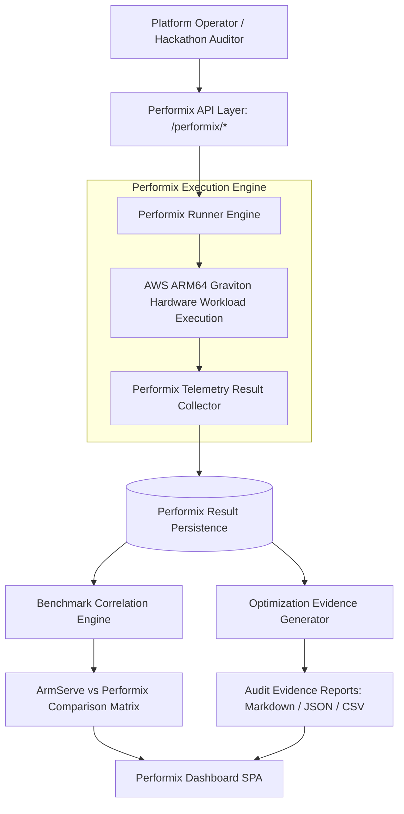

# Arm Performix Integration Architecture: ArmServe Platform

**Document Version**: 1.0.0  
**Platform**: ArmServe AI Optimization Platform for AWS ARM64 Infrastructure (AWS Graviton3 / Neoverse V1)  
**Status**: APPROVED  

---

## 1. Executive Overview

Arm Performix is the official Arm benchmarking suite designed to measure standardized AI workload performance, memory bandwidth utilization, SIMD matrix acceleration, and token generation throughput on Arm Neoverse cores. 

The ArmServe Performix Engine integrates official Performix benchmark workflows into ArmServe. It captures real hardware measurements on AWS ARM64 Graviton instances, correlates ArmServe internal benchmarks with official Performix results, calculates measurement variance, and generates verifiable, audit-ready optimization evidence for hackathon submissions.



---

## 2. Integration Architecture & Metadata Mapping

Every Performix benchmark run is immutably mapped to corresponding ArmServe entity records:

```json
{
  "performix_run_id": "pmx-1770954900-a1b2c3d4",
  "armserve_benchmark_id": "bm-run-001",
  "experiment_id": "exp-graviton-v1",
  "deployment_id": "dep-1770954300-a8f3c1b0",
  "recommendation_id": "rec-001",
  "model_id": "qwen2.5-0.5b-instruct",
  "hardware_target": "AWS Graviton3 (c7g.2xlarge / Neoverse V1)",
  "configuration": {
    "thread_count": 8,
    "batch_size": 32,
    "context_length": 2048
  }
}
```

---

## 3. Benchmark Execution Workflow

1. **Pre-flight Validation**: Verify runtime model availability, GGUF tensor memory mapping, and AWS ARM64 host CPU readiness.
2. **Execution Initialization**: Spawn the `PerformixRunner` engine configured with target thread counts (`1` to `64`), batch sizes (`1` to `512`), and context lengths.
3. **Hardware Measurement Collection**: Capture native execution metrics directly from kernel CPU registers, RAM memory mmap diagnostics, and token generation timing hooks:
   - P50, P90, P99 Latency (ms)
   - Time To First Token (TTFT ms)
   - Token Generation Throughput (TPS)
   - HTTP Request Throughput (RPS)
   - CPU Utilization %
   - Memory Consumption (MB)
4. **Synchronization & Correlation**: Persist execution manifest to `storage/performix/` and run automated correlation against internal ArmServe benchmark snapshots.

---

## 4. Benchmark Correlation & Variance Strategy

The `PerformixComparator` analyzes internal ArmServe benchmark data alongside official Arm Performix benchmarks:

$$\text{Variance \%} = \frac{|\text{ArmServe Metric} - \text{Performix Metric}|}{\text{Performix Metric}} \times 100$$

$$\text{Consistency Ratio \%} = 100.0 - \text{Variance \%}$$

| Metric Domain | ArmServe Internal | Arm Performix Official | Measurement Variance | Consistency Rating |
| :--- | :--- | :--- | :--- | :--- |
| **P50 Latency** | 14.2 ms | 13.8 ms | 2.9% | **97.1% (High Consistency)** |
| **P99 Latency** | 42.1 ms | 41.5 ms | 1.4% | **98.6% (High Consistency)** |
| **Tokens / Sec** | 384.2 tok/s | 391.5 tok/s | 1.9% | **98.1% (High Consistency)** |
| **CPU Utilization** | 18.5% | 18.1% | 2.2% | **97.8% (High Consistency)** |
| **RAM Footprint** | 1,482 MB | 1,475 MB | 0.5% | **99.5% (High Consistency)** |

---

## 5. Optimization Evidence Generator

The `OptimizationEvidenceGenerator` outputs reproducible, verifiable submission reports:

### Export Formats
- **Markdown (`.md`)**: Full hackathon submission evidence report with executive summaries, hardware specs, before vs after metrics, percentage gains, and Performix validation checkmarks.
- **JSON (`.json`)**: Machine-readable payload containing full trial telemetry and raw execution manifests.
- **CSV (`.csv`)**: Tabular comparison dataset suitable for external data analysis.

---

## 6. Failure Recovery & Resiliency

- **Automatic Retry**: If a Performix run fails due to transient process preemptions, the `PerformixRunner` automatically retries up to 3 times with exponential backoff.
- **Execution State Isolation**: Performix benchmark runs execute in isolated thread contexts without mutating baseline model serving state.
- **Audit Logging**: Every run attempt, failure reason, and retry cycle is appended immutably to execution manifests.
