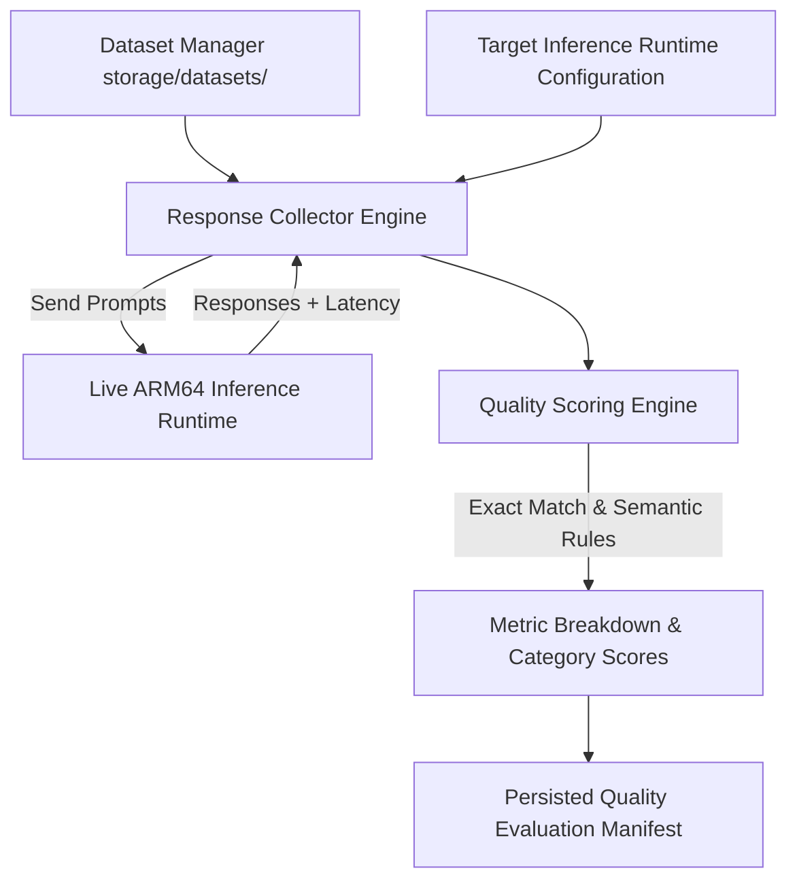

# ArmServe AI Quality Evaluation Framework Specification

**Role**: Quality Evaluation Architect  
**Platform**: ArmServe AI Optimization & Inference Platform (AWS Graviton ARM64)  
**Objective**: Systematic, reproducible quality evaluation comparing optimized CPU inference configurations against baselines without degradation in response accuracy, completeness, or instruction adherence.

---

## 1. Quality Evaluation Dimensions

ArmServe measures response quality across 6 quantitative dimensions:

| Dimension | Description | Evaluation Mechanism | Weight | Pass Threshold |
|---|---|---|---|---|
| **1. Correctness** | Factual and logical accuracy | Exact match / key term assertion / regex pattern | 0.25 | $\ge 80.0\%$ |
| **2. Completeness** | Inclusion of necessary detail & response length | Ratio of response length to expected token length | 0.20 | $\ge 75.0\%$ |
| **3. Factual Consistency** | Lack of hallucinations against source context | Token n-gram overlap & semantic similarity | 0.20 | $\ge 85.0\%$ |
| **4. Instruction Following** | Adherence to negative constraints & formatting requirements | Constraint rule validator (e.g. "JSON format", "under 50 words") | 0.15 | $\ge 90.0\%$ |
| **5. Formatting Consistency** | Structure integrity (JSON, Markdown tables, code blocks) | Syntax parser (JSON `json.loads`, markdown code fence check) | 0.10 | $\ge 95.0\%$ |
| **6. Response Stability** | Consistency across repeated runs under non-deterministic settings | Variance ($\sigma^2$) of similarity scores across 3 iterations | 0.10 | $\text{Variance} \le 0.05$ |

---

## 2. Evaluation Workflow & Architecture

1. **Dataset Selection**: Load versioned dataset JSON manifest (Reasoning, Summarization, Coding, QA, Classification).
2. **Response Collection**: Send prompts to the live inference engine under target runtime configuration (`thread_count`, `batch_size`, `quantization`). Record latency and response tokens.
3. **Automated Scoring**: Execute exact match, semantic similarity, and syntax parsers across all dimensions.
4. **Baseline Comparison**: Compute quality score delta ($\Delta Q = Q_{\text{target}} - Q_{\text{baseline}}$).
5. **Persistence**: Store evaluation results in `storage/quality/evals/{eval_id}.json`.

---

## 3. Scoring & Pass/Fail Thresholds

- **Individual Prompt Score**: $q_i \in [0.0, 100.0]$
- **Category Score**: $Q_c = \frac{1}{N_c} \sum_{i=1}^{N_c} q_i$
- **Overall Quality Score**: $Q = \sum w_c Q_c$
- **Mandatory Quality Guardrail**: Any optimization configuration that drops $Q$ by more than **$2.0\%$** relative to baseline is marked as **FAILED_QUALITY_DEGRADATION** and rejected from deployment.
